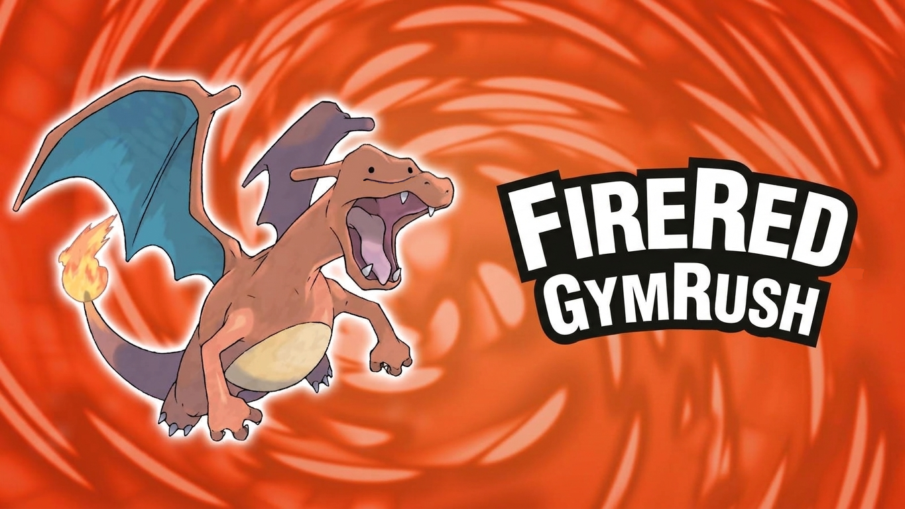

# ⚡ FireRed Gym Rush

<div align="center">



**Un simulador de combate Boss Rush estilo retro inspirado en Pokémon Rojo Fuego**

[](https://react.dev/)
[](https://vitejs.dev/)
[](https://tailwindcss.com/)
[](https://reactrouter.com/)
[](https://axios-http.com/)
[](https://eslint.org/)
[](https://www.w3.org/WAI/standards-guidelines/wcag/)
[](https://gym-rush.vercel.app/)

🎮 **[Jugar en Vivo / Demo](https://gym-rush.vercel.app/)**

</div>

---

## 📖 Descripción del Proyecto

**FireRed Gym Rush** es una aplicación web interactiva construida con **React 19**, **Vite** y **TailwindCSS**, diseñada como un desafío lineal tipo *Boss Rush*. Los jugadores asumen el rol de un entrenador Pokémon (Red o Leaf) y deben enfrentar consecutivamente a los **8 Líderes de Gimnasio de la región de Kanto**.

El proyecto combina la estética clásica de Game Boy Advance (pixel art, scanlines CRT, paleta de colores retro y tipografía `'Press Start 2P'`) con una arquitectura frontend moderna y modular, conectada a la [PokéAPI](https://pokeapi.co/) mediante Axios para la sincronización dinámica de estadísticas y sprites oficiales.

---

## 🕹️ Mecánicas de Juego y Progresión

### 👥 Selección y Personalización del Entrenador
* **Elección de Género:** Permite seleccionar entre Entrenador (**Red**) o Entrenadora (**Leaf**).
* **Teclado Retro Interactivo:** Sistema de introducción de nombre con teclado táctil virtual y soporte para teclado físico (mayúsculas, minúsculas, retroceso y confirmación).
* **Sprites Dinámicos de Combate:** Renderizado reactivo de avatares frontales y de espalda en combate adaptados al género seleccionado (incluyendo sprite exclusivo para Pikachu hembra).

### 🐢 Equipo de Iniciales y Sistema de Hitos de Evolución
El jugador inicia su aventura con un equipo fijo de 4 Pokémon: **Pikachu**, **Bulbasaur**, **Charmander** y **Squirtle**. A medida que avanza en el circuito de gimnasios, el equipo experimenta evoluciones por hitos:

| Etapa de Gimnasios | Nivel Promedio | Bulbasaur | Charmander | Squirtle | Pikachu |
| :--- | :---: | :---: | :---: | :---: | :---: |
| **Gimnasios 1 – 2** (Brock y Misty) | Nv. 15 | **Bulbasaur** | **Charmander** | **Squirtle** | **Pikachu** |
| **Gimnasios 3 – 5** (Surge, Erika y Koga) | Nv. 21 – 27 | **Ivysaur** | **Charmeleon** | **Wartortle** | **Pikachu** |
| **Gimnasios 6 – 8** (Sabrina, Blaine y Giovanni) | Nv. 30 – 36 | **Venusaur** | **Charizard** | **Blastoise** | **Pikachu** |

> **Nota:** Pikachu se mantiene en su forma base a lo largo de todo el desafío, aumentando su nivel y estadísticas.

### 🛡️ Restauración Completa y Gestión de Inventario
* **Recuperación Automática:** Al ingresar a cada nuevo gimnasio y en cada transición de combate, todos los miembros del equipo recuperan el **100% de sus Puntos de Salud (PS)**, se restauran los **Puntos de Poder (PP)** de todos sus movimientos y se limpian estados o modificadores alterados.
* **Bolsa de Pociones:** El jugador recibe un suministro de **6 Pociones** por gimnasio. Usar una poción restaura 20 PS al Pokémon activo y consume el turno del jugador.
* **Escalado de Dificultad:** Al derrotar a un líder de gimnasio, el equipo del jugador sube +3 niveles y aumenta +8 PS máximos para afrontar el siguiente desafío.

---

## 🏛️ Los 8 Líderes de Gimnasio de Kanto

| # | Líder | Ciudad | Medalla | Especialidad | Equipo Pokémon |
| :-: | :--- | :--- | :--- | :--- | :--- |
| **1** | **Brock** | Ciudad Plateada | Medalla Roca | Roca / Tierra | Geodude (Nv. 12), Onix (Nv. 14) |
| **2** | **Misty** | Ciudad Celeste | Medalla Cascada | Agua | Staryu (Nv. 18), Starmie (Nv. 21) |
| **3** | **Lt. Surge** | Ciudad Carmín | Medalla Trueno | Eléctrico | Voltorb (Nv. 21), Pikachu (Nv. 18), Raichu (Nv. 24) |
| **4** | **Erika** | Ciudad Azulona | Medalla Arcoíris | Planta / Veneno | Tangela (Nv. 29), Weepinbell (Nv. 29), Vileplume (Nv. 29) |
| **5** | **Koga** | Ciudad Fucsia | Medalla Alma | Veneno | Koffing (Nv. 37), Muk (Nv. 39), Koffing (Nv. 37), Weezing (Nv. 43) |
| **6** | **Sabrina** | Ciudad Azafrán | Medalla Pantano | Psíquico | Kadabra (Nv. 38), Mr. Mime (Nv. 37), Venomoth (Nv. 38), Alakazam (Nv. 43) |
| **7** | **Blaine** | Isla Canela | Medalla Volcán | Fuego | Growlithe (Nv. 42), Ponyta (Nv. 40), Rapidash (Nv. 42), Arcanine (Nv. 47) |
| **8** | **Giovanni** | Ciudad Verde | Medalla Tierra | Tierra / Roca | Rhyhorn (Nv. 45), Dugtrio (Nv. 42), Nidoqueen (Nv. 44), Nidoking (Nv. 45), Rhydon (Nv. 50) |

---

## 🧱 Arquitectura y Stack Tecnológico

```text
src/
├── assets/                  # Recursos multimedia estáticos locales (PNG y SVG)
│   ├── png/                 # Fondos de gimnasios, logos y sprites especiales
│   └── svg/                 # Retratos oficiales de líderes y avatares de entrenadores
├── components/              # Componentes de interfaz reutilizables (PascalCase)
│   ├── BattleArena/         # Escenario de combate, barras de vida, registro y controles
│   ├── GymLeaderCard/       # Tarjeta de presentación previa al líder con diálogo
│   ├── Navbar/              # Barra superior con navegación y avatar del entrenador
│   └── PokemonSelector/     # Selector de Pokémon líder y modal de cambio en combate
├── data/                    # Constantes y datos estáticos de líderes y equipos
│   └── gymLeaders.js        # Información de los 8 líderes, medallas, fondos y diálogos
├── docs/                    # Documentación interna del proyecto y estándares
│   └── codingStandards.md   # Convenciones de código, accesibilidad y buenas prácticas
├── hooks/                   # Custom Hooks con lógica de estado desacoplada
│   ├── useBattle.js         # Motor de combate, turnos, inventario, progresión y daño
│   └── usePokemon.js        # Hook de consulta y sincronización con la PokéAPI
├── pages/                   # Vistas y pantallas principales (rutas en minúsculas)
│   ├── battle/              # Pantalla principal de combate (BattleScreen)
│   ├── home/                # Flujo de bienvenida, selección y registro (HomeScreen)
│   ├── leaderboard/         # Tabla de clasificación global (LeaderboardScreen)
│   └── victory/             # Pantalla de celebración final (VictoryScreen)
├── services/                # Capa de red y consumo HTTP con Axios
│   ├── api.js               # Instancia base configurada de Axios
│   └── pokeApi.js           # Servicios para transformar y consultar datos de la PokéAPI
├── App.jsx                  # Configuración de enrutamiento con React Router DOM
├── index.css                # Estilos globales, tipografía retro y utilidades scanline
└── main.jsx                 # Punto de entrada de la aplicación React
```

### 🛠️ Tecnologías Principales
* **[React 19](https://react.dev/):** Biblioteca para interfaces de usuario declarativas mediante componentes funcionales y Hooks.
* **[Vite 8](https://vitejs.dev/):** Entorno de desarrollo y empaquetador ultrarrápido con HMR.
* **[TailwindCSS v4](https://tailwindcss.com/):** Framework de utilidades CSS para diseño responsive y adaptable.
* **[React Router DOM v7](https://reactrouter.com/):** Enrutamiento declarativo en el cliente (`/`, `/battle`, `/leaderboard`, `/victory-screen`).
* **[Axios](https://axios-http.com/):** Cliente HTTP con soporte para cancelación de solicitudes vía `AbortController`.
* **[PokéAPI](https://pokeapi.co/):** API REST pública para obtener estadísticas, tipos y sprites animados/oficiales.
* **[Supabase](https://supabase.com/):** Cliente configurado para futura persistencia y sincronización de puntajes en tiempo real.
* **[ESLint 10](https://eslint.org/):** Linter configurado con reglas estrictas de React Hooks y JavaScript ES6+.

---

## 🚀 Instalación y Puesta en Marcha Local

### Prerrequisitos
* **Node.js** (versión 18.0.0 o superior recomendada)
* **npm** (o yarn / pnpm)

### Pasos de Instalación

1. **Clonar el repositorio:**
   ```bash
   git clone https://github.com/wfhgdev/RedFire-GymRush.git
   cd RedFire-GymRush
   ```

2. **Instalar dependencias:**
   ```bash
   npm install
   ```

3. **Iniciar el servidor de desarrollo:**
   ```bash
   npm run dev
   ```
   Abre tu navegador en `http://localhost:5173` para comenzar a jugar.

4. **Ejecutar el linter de código:**
   ```bash
   npm run lint
   ```

5. **Construir para producción:**
   ```bash
   npm run build
   ```

---

## 🎨 Estándares de Desarrollo y Accesibilidad

El proyecto se rige por las directrices establecidas en [`docs/codingStandards.md`](./docs/codingStandards.md):
* **Código en Inglés / UI en Español:** Todo el código fuente (variables, funciones, componentes) se redacta en inglés; toda la interfaz visible para el usuario se encuentra en español.
* **Accesibilidad Web (WCAG 2.1 AA):** Elementos semánticos HTML5 (`<main>`, `<section>`, `<article>`, `<header>`, `<nav>`), etiquetas descriptivas `aria-label`, contraste visual optimizado y navegación fluida por teclado con indicadores de foco `:focus-visible`.
* **Clean Code:** Funciones de responsabilidad única, guard clauses, código autoexplicativo sin comentarios innecesarios y cero advertencias de ESLint.

---

## 👨‍💻 Autor

Desarrollado con dedicación por **William Hernández** ([@wfhgdev](https://github.com/wfhgdev)).

*Proyecto creado con fines educativos y de homenaje a la franquicia Pokémon.*